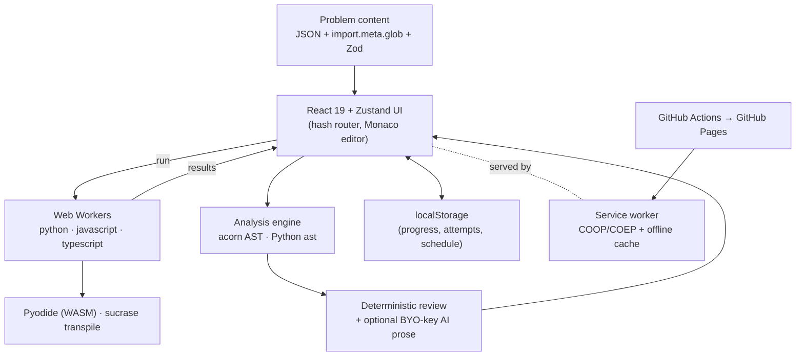

# NoobCode

**[▶ Live demo](https://audioisaac.github.io/NoobCode/)** — a client-side,
LeetCode-style coding trainer that runs entirely in the browser. **No backend, no
server.** Solve problems in Python (via Pyodide), JavaScript, or TypeScript, get a
deterministic review of your approach, and track mastery with spaced repetition.

[](https://github.com/audioisaac/NoobCode/actions/workflows/deploy.yml)


## Highlights

What makes this more than a CRUD app:

- **Runs real code in the browser, sandboxed.** Python executes on Pyodide
  (WebAssembly); JS runs directly; TypeScript is transpiled on the fly with
  sucrase. Every run happens in a **Web Worker** with a timeout watchdog, and a
  **Stop button backed by a `SharedArrayBuffer` hard interrupt** that can kill an
  infinite loop the cooperative path can't.
- **Cross-origin isolation on a static host.** `SharedArrayBuffer` needs COOP/COEP
  headers, which GitHub Pages can't serve. A **custom service worker** injects them
  (and caches the runtime offline) so the deployed site is `crossOriginIsolated`.
- **Deterministic code review, no AI required.** An analysis engine parses your
  solution (acorn for JS/TS, Python's own `ast`), classifies the approach
  (hash-map, two-pointers, sliding-window, …) and estimates time/space complexity,
  then compares it against the reference solution. An **optional** BYO-key AI coach
  only rewrites that verdict as prose — it never changes it.
- **Spaced repetition + mastery.** A Leitner schedule resurfaces problems when due;
  per-pattern mastery is derived from recency-weighted attempts.
- **Privacy-first & offline-capable.** No backend, no analytics; all progress lives
  in `localStorage`. Installable PWA.
- **Typed end to end.** Strict TypeScript, Zod-validated content, ESLint flat
  config, and a CI pipeline that gates every deploy.

## Architecture



## Features

- **In-browser code execution** — Python on Pyodide (self-hosted WASM, lazily
  loaded); JavaScript in a worker; TypeScript transpiled via sucrase. All run in
  Web Workers with a timeout watchdog and a Stop button.
- **JSON-defined problems** — every problem is a plain JSON file in
  `src/content/problems/`, auto-discovered at build time. Add your own by dropping
  a file in that directory (see below).
- **Monaco editor** with custom `light` / `dark` themes and read-only diff views.
- **Deterministic analysis** — an AST/heuristic engine classifies your approach
  and estimates time/space complexity, then compares it to the optimal solution.
- **Optional AI coach (BYO key)** — add an Anthropic API key in Settings and the
  AI rewrites the review as friendly prose (streamed, with token/cost shown) and
  can explain solution steps. The AI never changes the verdict.
- **Spaced repetition** — a Leitner schedule surfaces problems when they are due.
- **Skills & mastery** — per-pattern mastery from recency-weighted attempts, plus a
  language/data-structure method reference that marks methods you've used before.
- **Attempt history** — past submissions are diffable against your current code.

## Tech stack

React 19 · TypeScript (strict) · Vite 8 · Tailwind CSS v4 · Zustand · Zod ·
Monaco · Pyodide · sucrase · acorn · Vitest · ESLint (flat) · GitHub Actions.

## Development

Requires **Node 22.12+** (Vite 8). The repo pins this via `.nvmrc` and
`package.json` `engines`, so `nvm use` picks the right version. On an older Node
(e.g. 22.6), `npm run dev` fails with a rolldown "Cannot find native binding"
error — fix it with:

```bash
nvm install 22.12 && nvm use
rm -rf node_modules package-lock.json && npm install
```

```bash
npm install
npm run dev        # start the dev server (with COOP/COEP headers for Pyodide)
```

## Quality gates

```bash
npm run lint             # ESLint
npm run typecheck        # tsc --noEmit
npm run test             # Vitest unit/component tests
npm run validate:content # validate problem content against the Zod schema
npm run build            # production build (tsc + vite build)
npm run preview          # serve the production build locally
```

## Deployment

Pushing to `main` triggers `.github/workflows/deploy.yml`, which runs every
quality gate above and publishes `dist/` to GitHub Pages.

Three things make the static deploy work:

- **Hash routing** (`createHashRouter`) — GitHub Pages can't do SPA rewrites, so
  deep links use the hash, e.g. `/#/problems/two-sum`.
- **Base path** — production builds under `/NoobCode/` (the project-site path) via
  `vite.config.ts`; override with the `BASE_PATH` env var for a custom domain.
- **Cross-origin isolation** — Pyodide needs `SharedArrayBuffer`, which requires
  COOP/COEP headers. They're set for `dev`/`preview` in `vite.config.ts`; in
  production a **service worker** (`public/sw.js`) injects them, since Pages can't
  serve custom headers.

## Privacy

NoobCode is fully static. Your progress lives in `localStorage`. If you enable the
AI coach, your API key is stored in `localStorage` only and sent directly from your
browser to Anthropic — use a scoped key.

## Adding a problem

Problems are JSON files in `src/content/problems/<slug>.json`, auto-discovered via
`import.meta.glob` — no registration step. Each problem must provide code for every
language (Python, JavaScript, TypeScript) in `functionName`, `starterCode`, and
every solution step.

1. Create the file. Any of:
   - Copy [`templates/problem.template.json`](templates/problem.template.json) to
     `src/content/problems/<slug>.json`, or
   - run `npm run new:problem -- <slug> "Title"`, or
   - open **New** in the app — during `npm run dev` it writes the skeleton file for
     you; on the hosted site it downloads it to drop in.
2. Fill it in. Set `slug` to match the filename.
3. `npm run validate:content` checks it against the schema; restart `npm run dev`.

See **[docs/PROBLEM_JSON.md](docs/PROBLEM_JSON.md)** for the full field reference
and **[docs/SOLUTION_INSTRUCTIONS.md](docs/SOLUTION_INSTRUCTIONS.md)** for how to
break a solution into incremental steps.

## License

[MIT](LICENSE)
